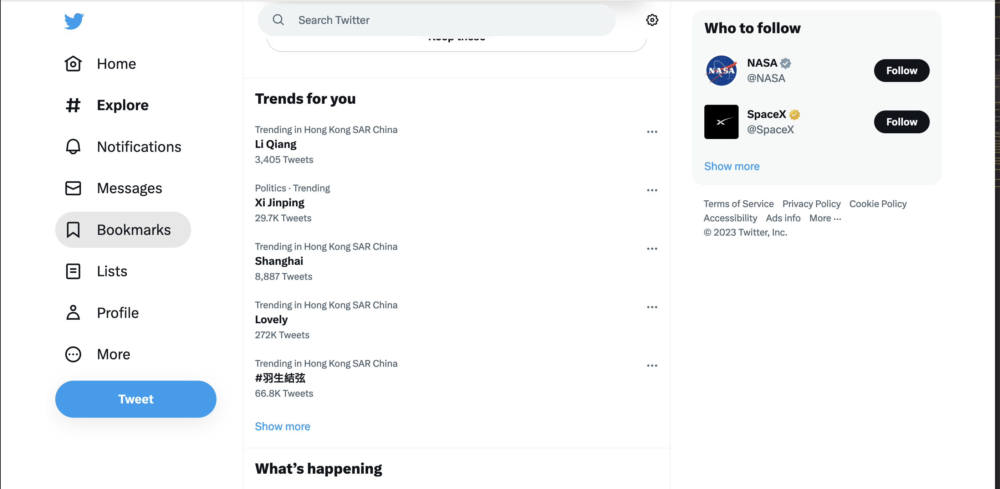
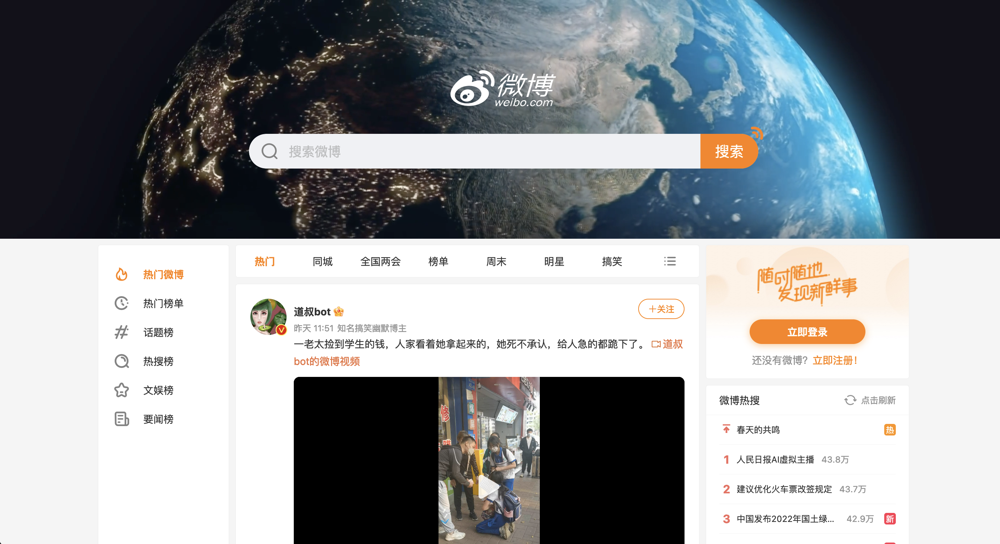
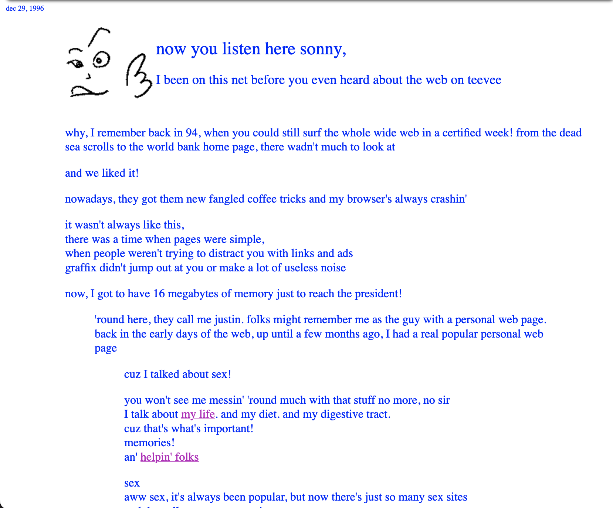

title: The rise ,fade and future of Personal Blogs
speaker: 胡宗禹
plugins:
    - echarts

<slide class="bg-black-blue aligncenter" image="https://source.unsplash.com/C1HhAQrbykQ/ .dark">

# Personal Blogs {.text-landing.text-shadow}
 
#### Emergence, Evolution and Future {.animated.fadeInDown.delay-800}

  

By 胡宗禹 {.text-subtitle.animated.fadeInDown.delay-1600}

<slide class="bg-black-blue aligncenter" image="https://source.unsplash.com/C1HhAQrbykQ/ .dark">

### `PART ONE`
# A Brief Introduction of Some Essential Terms

<slide class="bg-black-blue slide-top">

:::{.content-left}

### HTML & CSS
* HTML is `HyperText Markup Language`(超文本标记语言).
* CSS is `Cascading Style Sheets`(样式表)

HTML and CSS describe what a web page looks like.

<slide class="bg-black-blue slide-top" image="https://source.unsplash.com/C1HhAQrbykQ/ .dark">

:::div {.content-left}

### Javacript
The work of Javascript is listen your click or other actions and give response.
:::
:::div {.content-right}

### PHP
PHP is `Hypertext Preprocessor`(超文本预处理器)

The PHP code is processed on the web server and give HTML to your computer.And the computer will rend a web page.PHP is usually used to connect and operate the database or other files on the server.
<!-- [:fa-github: Github](https://github.com/ksky521/nodeppt){.button.ghost} -->
:::
<slide class="bg-black-blue slide-top" image="https://source.unsplash.com/C1HhAQrbykQ/ .dark">
:::{.content-left}

### Static Web Page

Static Web Page is a site that use only HTML JS and CSS to rend a site.

*such as this site*
:::
:::{.content-right}
### Dynamic Web Page
Any site using PHP or other backend language to transfer infomation called `Dynamic Web Page`.
:::
<slide class="bg-black-blue slide-top" image="https://source.unsplash.com/C1HhAQrbykQ/ .dark">

## Such As These...
:::{.content-left}

:::
:::{.content-right}

:::
<slide class="bg-black-blue slide-top" image="https://source.unsplash.com/C1HhAQrbykQ/ .dark">
## And These...
:::{.content-left}

:::
:::{.content-right}

:::

<slide class="bg-black-blue aligncenter" image="https://source.unsplash.com/C1HhAQrbykQ/ .dark">

### `PART TWO`
# The history of blogs

<slide class="bg-black-blue slide-top" image="https://source.unsplash.com/C1HhAQrbykQ/ .dark">

### The origin of the term `blog`
 
:::div {.content-left}
> The term "weblog" was coined by Jorn Barger on December 17, 1997. The short form, "blog", was coined by Peter Merholz, who jokingly broke the word weblog into the phrase we blog in the sidebar of his blog Peterme.com in May 1999.
> ==from wikipedia==
:::
<slide class="bg-black-blue slide-top" image="https://source.unsplash.com/C1HhAQrbykQ/ .dark">

### How blogs evolve?
 
in the Twentieth Century,the blogs are mostly written in HTML and look like this\:

<slide class="bg-black-blue slide-top" video="./img/blog1.mp4 .dark">
with the introduction of web techniques, the website become more and more fancy and impressing...

<slide class="bg-black-blue aligncenter" image="https://source.unsplash.com/C1HhAQrbykQ/ .dark">
### `PART THREE`
# How personal blogs be forgotten by time
<slide class="bg-black-blue aligncenter" image="https://source.unsplash.com/C1HhAQrbykQ/ .dark">
## the transition from hobby to business
<slide class="bg-black-blue aligncenter" image="https://source.unsplash.com/C1HhAQrbykQ/ .dark">
## the cost and time
<slide class="bg-black-blue aligncenter" image="https://source.unsplash.com/C1HhAQrbykQ/ .dark">
## the emergence of microblogs platform
<slide class="bg-black-blue aligncenter" image="https://source.unsplash.com/C1HhAQrbykQ/ .dark">
## the rise of search engine
<slide class="bg-black-blue aligncenter" image="https://source.unsplash.com/C1HhAQrbykQ/ .dark">
### `PART FOUR`
# Why we still need personal blogs?
 is personal blog dying or just meaningless?{.animated.fadeInDown.delay-800}
<slide class="bg-black-blue aligncenter" image="https://source.unsplash.com/C1HhAQrbykQ/ .dark">
## The freedom of posting whatever we want
<slide class="bg-black-blue aligncenter" image="https://source.unsplash.com/C1HhAQrbykQ/ .dark">
## The recording of our life and problems we met
<slide class="bg-black-blue aligncenter" image="https://source.unsplash.com/C1HhAQrbykQ/ .dark">
## A longevity

> —— no longer be restricted by platforms
<slide class="bg-black-blue aligncenter" image="https://source.unsplash.com/C1HhAQrbykQ/ .dark">

### `PART FIVE`

# How to build a blog at ZERO cost?
The answer is [gitee](https://www.gitee.io)

<slide class="bg-black-blue aligncenter" image="https://source.unsplash.com/C1HhAQrbykQ/ .dark">

### `PART SIX`
# The future

<slide class="bg-black-blue aligncenter" image="https://source.unsplash.com/C1HhAQrbykQ/ .dark">
# Thanks
